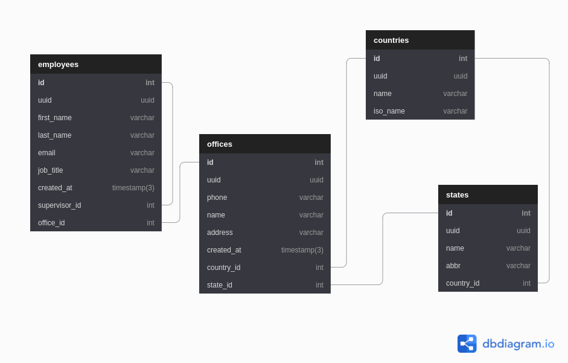

<p align="center">
 <a href="https://www.ravn.co/" rel="noopener">
 </a>
</p>
<p align="center">
 <a href="https://www.postgresql.org/" rel="noopener">
 </a>
</p>

---

<p align="center">A project to show off your skills on databases & SQL using a real database</p>

## 📝 Table of Contents

- [Case](#case)
- [Installation](#installation)
- [Data Recovery](#data_recovery)
- [Excersises](#excersises)

## 🤓 Case <a name = "case"></a>

As a developer and expert on SQL, you were contacted by a company that needs your help to manage their database which runs on PostgreSQL. The database provided contains four entities: Employee, Office, Countries and States. The company has different headquarters in various places around the world, in turn, each headquarters has a group of employees of which it is hierarchically organized and each employee may have a supervisor. You are also provided with the following Entity Relationship Diagram (ERD)

#### ERD - Diagram <br>

 <br>

---

## 🛠️ Docker Installation <a name = "installation"></a>

1. Install [docker](https://docs.docker.com/engine/install/)

---

## 📚 Recover the data to your machine <a name = "data_recovery"></a>

Open your terminal and run the follows commands:

1. This will create a container for postgresql:

```
docker run --name nerdery-container -e POSTGRES_PASSWORD=password123 -p 5432:5432 -d --rm postgres:13.0
```

2. Now, we access the container:

```
docker exec -it -u postgres nerdery-container psql
```

3. Create the database:

```
create database nerdery_challenge;
```

4. Restore de postgres backup file

```
cat /.../src/dump.sql | docker exec -i nerdery-container psql -U postgres -d nerdery_challenge
```

- Note: The `...` mean the location where the src folder is located on your computer
- Your data is now on your database to use for the challenge

---

## 📊 Excersises <a name = "excersises"></a>

Now it's your turn to write SQL querys to achieve the following results:

1. Count the total number of states in each country.

```
Your query here
```

<p align="center">
 
</p>

2. How many employees do not have supervisores.

```
Your query here
```

<p align="center">
 
</p>

3. List the top five offices address with the most amount of employees, order the result by country and display a column with a counter.

```
Your query here
```

<p align="center">
 
</p>

4. Three supervisors with the most amount of employees they are in charge.

```
Your query here
```

<p align="center">
 
</p>

5. How many offices are in the state of Colorado (United States).

```
Your query here
```

<p align="center">
 
</p>

6. The name of the office with its number of employees ordered in a desc.

```
Your query here
```

<p align="center">
 
</p>

7. The office with more and less employees.

```
Your query here
```

<p align="center">
 
</p>

8. Show the uuid of the employee, first_name and lastname combined, email, job_title, the name of the office they belong to, the name of the country, the name of the state and the name of the boss (boss_name)

```
Your query here
```

<p align="center">
 
</p>
