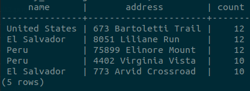

<p align="center">
 <a href="https://www.ravn.co/" rel="noopener">
 </a>
</p>

---

<p align="center">A project to show your skills on databases using a real database</p>

## 📝 Table of Contents

- [About](#about)
- [Installation](#installation)
- [Data Recovery](#data_recovery)
- [Chores](#chores)

## 🤓 About <a name = "about"></a>

The database provided corresponds to a company in which it has different headquarters in various places around the world, in turn, each headquarters has a group of employees of which it is hierarchically organized and each employee may have a supervisor. That said we have the following Entity Relationship Diagram (ERD)

#### ERD - Diagram <br>

 <br>

---

## 🛠️ Installation <a name = "installation"></a>

You have two ways to install PostgreSQL:

1. Download the PostgreSQL server [here.](https://www.postgresql.org/download/)
2. Install [docker](https://docs.docker.com/engine/install/) and the [PostgreSQL container.](https://hub.docker.com/_/postgres)

Whatever method you choose, then you will have to perform the data restoration and continue with the activities

---

## 📚 Data Recovery <a name = "data_recovery"></a>

Open your terminal and run the follows commands:

1. This will create a container for postgresql:

```
docker run --name nerdery-container -e POSTGRES_PASSWORD=password123 -p 5432:5432 -d --rm postgres:13.0
```

2. Now, we access the container:

```
docker exec -it -u postgres nerdery-container psql
```

3. Create the database:

```
create database nerdery_challenge;
```

4. Restore de postgres backup file

```
cat /.../src/dump.sql | docker exec -i nerdery-container psql -U postgres -d nerdery_challenge
```

- Note: The `...` mean the location where the src folder is located on your computer
- Your data is now on your database to use for the challenge

---

## 📊 Chores <a name = "chores"></a>

Said the above, the following results are desired:

1. Count the total number of states in each country.

```
Your query here
```


2. How many employees do not have supervisores.

```
Your query here
```


3. List the top 5 offices address with the most employees and your country

```
Your query here
```



4. Three supervisores with the most employees who are in charge.

```
Your query here
```

5. How many offices are in the United States and in the state of Colorado.

```
Your query here
```


6. The average number of employees per office.

```
Your query here
```

7. The office with more and less employees.

```
Your query here
```


8. Show the uuid of the employee, first_name and lastname combined, email, job_title, the name of the office they belong to, the name of the country, the name of the state and the name of the boss (boss_name)

```
Your query here
```
